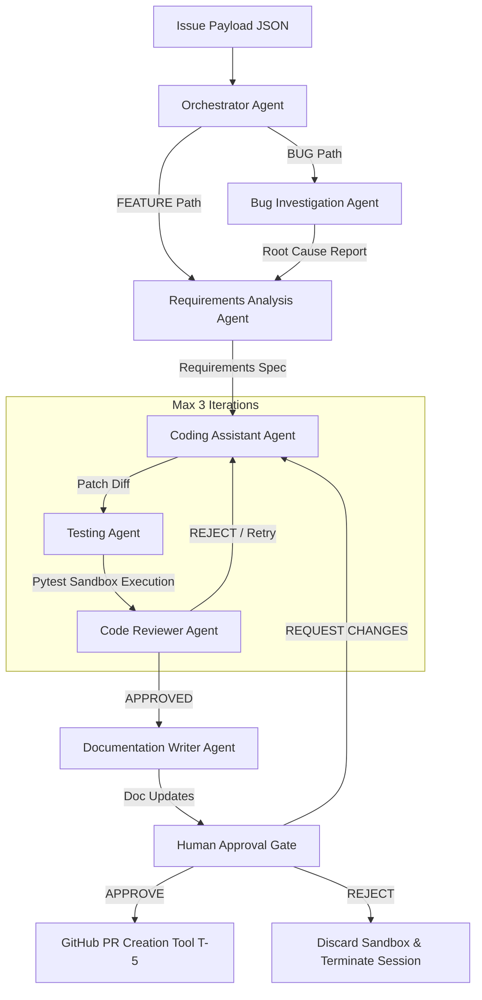

# 🧪 Rick Software Assistant — Autonomous 7-Agent AI Engineer

[](https://www.python.org/)
[](https://docs.pytest.org/)
[](#-multi-agent-system-architecture)
[](#-safety-invariants--architectural-guarantees)
[](https://groq.com/)

> **Rick Software Assistant** is a production-grade, multi-agent AI software engineering pipeline in Python. It ingests GitHub issues, investigates root causes, formulates requirements, generates patch diffs, executes test suites in isolated sandboxes, and dispatches verified Pull Requests—all governed by strict Pydantic state-machine validation and hard safety invariants. Includes an optional **Rick Sanchez Persona Decorator** for custom narrative output!

---

## 📐 Multi-Agent System Architecture

The pipeline consists of **7 specialized LLM agents** communicating via a strictly validated Pydantic state schema (`SessionState` with `validate_assignment=True`).



---

## 🤖 The 7 Specialized Agents

| Agent Name | Role & Responsibility | Tier / Model |
| :--- | :--- | :--- |
| **Orchestrator Agent** | Dual-path issue classification (`BUG` vs `FEATURE`) and pipeline lifecycle management. | `lightweight` / Groq |
| **Bug Investigation Agent** | Executes `ripgrep` searches (`Tool T-2`) to identify exact file line ranges and formulate root-cause hypotheses. | `heavy` / Groq |
| **Requirements Analysis Agent** | Translates issue bodies & bug reports into structured acceptance criteria and target file scopes. | `heavy` / Groq |
| **Coding Assistant Agent** | Generates unified git diff patches matching the requirements specification. | `heavy` / Groq |
| **Testing Agent** | Copies `demo_repo/` to `.sandbox/{session_id}/`, applies patch diffs, and executes `pytest` in isolation (`Tool T-3`). | `lightweight` / Groq |
| **Code Reviewer Agent** | Evaluates code quality, static linter warnings (`Tool T-4`), and test results to issue `APPROVED` or `REJECT` decisions. | `heavy` / Groq |
| **Documentation Writer Agent** | Generates structured docstring updates and changelog entries (`Tool T-2`) for approved code patches. | `heavy` / Groq |

---

## 🛡️ Safety Invariants & Architectural Guarantees

The architecture guarantees 3 binary pass/fail safety invariants enforced at the model and state level:

- 🔒 **Invariant I-1 (Human Gate Enforcement)**: Pull Request creation (`Tool T-5`) is physically impossible to execute without an explicit `APPROVE` decision at the Human Approval Gate.
- 🧪 **Invariant I-2 (Cryptographic Sandbox Isolation)**: Test execution occurs strictly within `.sandbox/{session_id}/`. The `demo_repo/` directory tree is verified via SHA-256 tree hashing to remain 100% unmutated.
- 🗑️ **Invariant I-3 (Reject Discards Branch)**: Selecting `REJECT` at the Human Gate instantly purges the sandbox directory from disk without dispatching a PR or leaving remote artifacts.

---

## 🥒 Rick Sanchez Persona Decorator

When enabled via environment configuration (`PERSONA_ENABLED=true`), a post-processing narrative decorator rewrites the Human Approval Gate summary into the voice of **Rick Sanchez** (*Rick and Morty*).

> **Why a post-processing decorator?**  
> Embedding narrative personas directly into system prompts risks contaminating structured JSON outputs (e.g. diffs containing Rick commentary). Post-processing guarantees that agent logic remains 100% clean and structured while giving operators a unique CLI experience!

---

## 🚀 Quick Start Guide

### Prerequisites
- Python 3.12+
- Git

### 1. Installation
Clone the repository and set up the virtual environment:
```bash
git clone https://github.com/CodeCrafterAdi2006/Rick_Software_Assistant.git
cd Rick_Software_Assistant

python -m venv .venv
.\.venv\Scripts\activate  # Windows (or source .venv/bin/activate on Linux/macOS)
pip install -r requirements.txt
```

### 2. Environment Setup
Copy `.env.example` to `.env` and add your API keys:
```env
GROQ_API_KEY=your_groq_api_key_here
PERSONA_ENABLED=true
GITHUB_LIVE_MODE=false
```

### 3. Launch the Gradio Desktop Application 🖥️
Run the desktop window launcher using your virtual environment Python:

**Option A (Direct Command - Recommended)**:
```bash
.\.venv\Scripts\python.exe launch.py
```
*(On Linux/macOS: `./.venv/bin/python launch.py`)*

**Option B (If Virtual Environment is Activated)**:
```bash
.\.venv\Scripts\activate
python launch.py
```

> **Desktop Window**: Automatically opens a native PyWebView desktop window at `http://127.0.0.1:7861`. If PyWebView is unavailable, fallback browser navigation is provided automatically.

---

## 🖥️ Desktop Application Features

The Gradio 6.0 interface (`app.py`) provides an interactive control center for the multi-agent pipeline:

* **Rick Mascot Panel**: Real-time contextual dialogue status bubble.
* **Issue Selector**: Choose benchmark payloads (`issues/bug_42.json`, `issues/feature_7.json`, `issues/partial_44.json`) or upload custom issue JSONs.
* **5 Live Inspection Tabs**:
  1. 📝 **Patch Diff**: Formatted unified diff viewer.
  2. 🧪 **Test Execution**: Pytest sandbox status (`PASS`/`FAIL`), test counts, and raw tracebacks.
  3. 🛡️ **Code Review & Lints**: Code reviewer critique decisions and static linter outputs (`Tool T-4`).
  4. 📚 **Documentation**: Generated docstrings and changelog entries.
  5. 🔍 **Session Telemetry**: Full Pydantic `SessionState` JSON dump.
* **Interactive Human Approval Gate**:
  * 🟢 **Approve & Open Pull Request**: Dispatches `Tool T-5` to create a GitHub PR and clean up sandbox.
  * 🟡 **Request Changes & Retry Pass**: Input custom feedback for the Coding Assistant and trigger a fresh reflection pass.
  * 🔴 **Reject Session**: Immediately purges `.sandbox/{session_id}` from disk.
* **Settings Modal**: Configure `GROQ_API_KEY`, toggle persona mode, and view active multi-key pool rotation.

---

### 4. CLI Execution (Optional)
Run the pipeline directly from the command line:
```bash
python -m agent_system issues/bug_42.json
```

### 5. Benchmark Evaluation Suite
Evaluate the agent pipeline across the 13-payload benchmark suite:
```bash
python scripts/run_benchmark.py
```

---

## 🧪 Verification & Test Suite

The repository contains a full 88-test unit suite validating schema state transitions, guard chains, tools, and safety invariants.

Run the test suite:
```bash
python -m pytest
```

Output:
```text
============================= test session starts =============================
platform win32 -- Python 3.12.6, pytest-9.1.1, pluggy-1.6.0
collected 88 items

tests\agents\test_agent_pipeline.py .                                    [  1%]
tests\agents\test_bug_investigation.py ..                                [  3%]
tests\agents\test_documentation_writer.py ..                             [  5%]
tests\agents\test_reflection_loop.py ........                            [ 14%]
tests\agents\test_requirements_analysis.py ...                           [ 18%]
tests\test_cli.py .......                                                [ 26%]
tests\test_config.py ....                                                [ 30%]
tests\test_gate.py .....                                                 [ 36%]
tests\test_invariants.py ......                                          [ 43%]
tests\test_logging.py ......                                             [ 50%]
tests\test_persona.py ....                                               [ 54%]
tests\test_schemas.py ...................                                [ 76%]
tests\tools\test_github_api.py .....                                     [ 81%]
tests\tools\test_linter.py ..                                            [ 84%]
tests\tools\test_pytest_runner.py .......                                [ 92%]
tests\tools\test_repo_search.py .......                                  [100%]

============================= 88 passed in 8.20s ==============================
```

---

## 📊 Performance & Benchmark Metrics (NFR-4)

Evaluated across 13 benchmark payloads (`issues/benchmark/`):

- **Average Pipeline Latency**: **6.90 seconds per run**
- **Documentation Coverage Rate (K-3)**: **100.0%** (for all approved dispatches)
- **Safety Invariant Violations**: **0 (0.0%)**

---

## 📜 License

Distributed under the MIT License. See `LICENSE` for more information.
