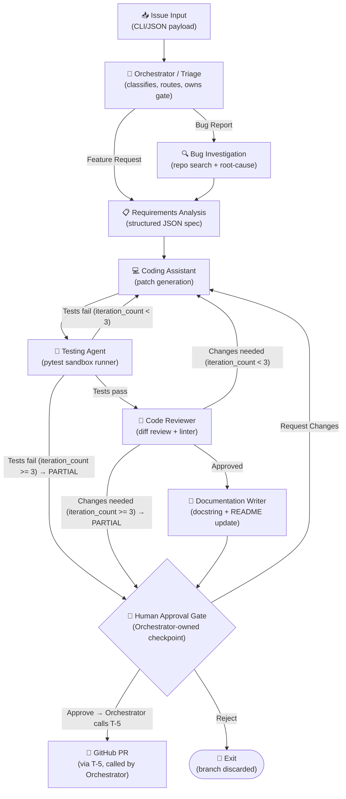
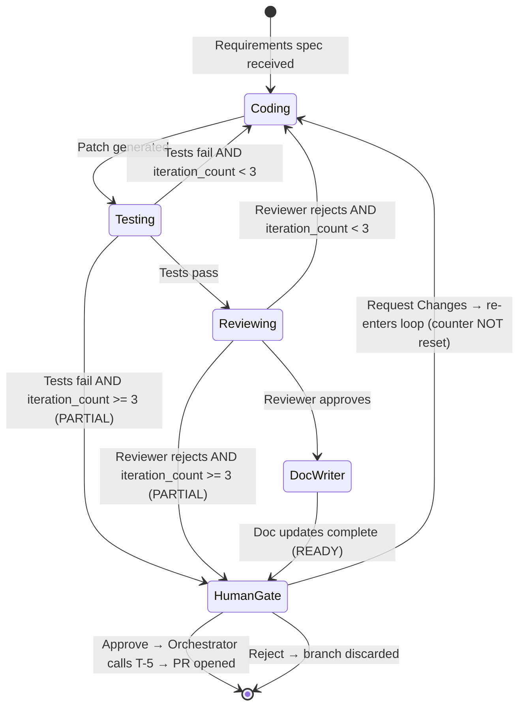

# System Design: AI Software Engineering Assistant

> **Document Status**: v3 — Post-Audit Polish  
> **Source Seed**: [idea.md](file:///c:/AI%20Native%20founder/IIT%20Jammu%20Assignments/Final_project_2/idea.md)  
> **Source PRD**: [prd.md](file:///c:/AI%20Native%20founder/IIT%20Jammu%20Assignments/Final_project_2/prd.md)  
> **Scope (per `idea.md §5`)**: Agent architecture diagram, handoff flow, tool integration overview, data flow between agents, and one section per agent. This is the reference file to keep open while writing agent code.  
> **Does NOT own**: Tech stack, SDK version, model/provider config, Pydantic schema implementations, error handling, test strategy — all in `engineering.md`.  
> **Changes from v2**: (1) GATE and EXIT nodes given visually distinct shapes (diamond / stadium) in §1.1 diagram to signal control-flow vs agent at a glance; (2) §2.2 note and §5.4 Retry Counter explicitly document the single-automated-pass-per-Request-Changes behaviour.

---

## 1. System Architecture Overview

### 1.1 High-Level Agent Map



### 1.2 Two Pipeline Paths at a Glance

| Step | Bug Report Path | Feature Request Path |
| :--- | :--- | :--- |
| **1 — Triage** | Classified as `BUG` | Classified as `FEATURE` |
| **2 — Bug Investigation** | ✅ Runs — produces root-cause report | ⛔ Skipped entirely |
| **3 — Requirements Analysis** | Runs after Bug Investigation | Runs immediately after Triage |
| **4 — Context Gathering** | Coding Assistant extends root-cause report | Coding Assistant searches from scratch |
| **5 — Coding → Test → Review** | Identical in both paths | Identical in both paths |
| **6 — Doc Writer → Gate → PR** | Identical in both paths | Identical in both paths |

---

## 2. Handoff Flow & State Machine

### 2.1 Session State Object (logical view)

A single `SessionState` object is threaded through every agent handoff. Agents receive the current state, add their output, and pass it forward. No agent can skip a predecessor's output — the schema enforces presence of prior fields before later fields can be set.

```
SessionState
├── issue              (raw input — set by Orchestrator)
├── classification     ("BUG" | "FEATURE" — set by Orchestrator)
├── root_cause_report  (Bug path only — set by Bug Investigation)
├── requirements_spec  (set by Requirements Analysis)
├── patch              (set by Coding Assistant, overwritten on retry)
├── test_result        (set by Testing Agent)
├── review_result      (set by Code Reviewer)
├── doc_updates        (set by Documentation Writer)
├── iteration_count    (incremented on each coding retry + human Request Changes)
├── status             ("IN_PROGRESS" | "READY" | "PARTIAL")
└── gate_decision      ("APPROVE" | "REQUEST_CHANGES" | "REJECT" — set by human)
```

*Schema implementation (Pydantic classes, field validators) lives in `engineering.md`.*

### 2.2 Reflection Loop State Machine



> [!NOTE]
> **`>= 3` guard closes the boundary gap**: if the human uses `Request Changes` when `iteration_count` is already at 3, the incremented counter (4, 5, …) still routes correctly to PARTIAL on the next automated failure — no undefined transition.
>
> **Single automated pass per `Request Changes` cycle**: by definition, if the human is looking at a PARTIAL screen, `iteration_count >= 3` is already true. After `Request Changes` the counter increments to at least 4. The Coding Assistant produces one new patch — if Testing or Reviewing then fail, `>= 3` fires immediately and the gate reappears. Each human feedback cycle gets **one** automated attempt, not a fresh 3-retry budget. This is intentional (FR-8.4: the human is the effective cap on the outer loop) — stated here to prevent a “wait, is this a bug?” read of the state machine.

### 2.3 Consolidated Handoff Trigger Table

| From Agent | To Agent | Trigger Condition | Data Passed |
| :--- | :--- | :--- | :--- |
| *Input* | Orchestrator | Issue JSON received | Raw issue payload |
| Orchestrator | Bug Investigation | `classification == "BUG"` | Raw issue + session state |
| Orchestrator | Requirements Analysis | `classification == "FEATURE"` | Raw issue + session state |
| Bug Investigation | Requirements Analysis | Root-cause report produced | Root-cause report added to state |
| Requirements Analysis | Coding Assistant | Requirements spec produced | Full session state (spec + optional root-cause) |
| Coding Assistant | Testing Agent | Patch generated | Patch diff added to state |
| Testing Agent | Code Reviewer | `test_result.status == "PASS"` | Test result added to state |
| Testing Agent | Coding Assistant | `test_result.status == "FAIL" AND iteration_count < 3` | Failure log injected into state |
| Testing Agent | Human Gate (Orchestrator) | `test_result.status == "FAIL" AND iteration_count >= 3` | State with `status = "PARTIAL"` |
| Code Reviewer | Documentation Writer | `review_result.decision == "APPROVED"` | Reviewer notes added to state |
| Code Reviewer | Coding Assistant | `review_result.decision == "CHANGES_NEEDED" AND iteration_count < 3` | Reviewer critique injected into state |
| Code Reviewer | Human Gate (Orchestrator) | `review_result.decision == "CHANGES_NEEDED" AND iteration_count >= 3` | State with `status = "PARTIAL"` |
| Documentation Writer | Human Gate (Orchestrator) | Doc updates written | `status = "READY"`, doc diffs added |
| Human Gate (Orchestrator) | *T-5 — GitHub PR API* | `gate_decision == "APPROVE"` | Full session state → PR metadata |
| Human Gate (Orchestrator) | Coding Assistant | `gate_decision == "REQUEST_CHANGES"` | Human feedback text injected; `iteration_count` incremented |
| Human Gate (Orchestrator) | *Exit* | `gate_decision == "REJECT"` | Session logged; branch discarded |

---

## 3. Tool Integration Overview

The system exposes **5 runtime tool integrations** (satisfying the ≥5 rubric requirement). Each tool is a callable function accessible to specific agents.

| # | Tool Name | Agents That Use It | What It Does |
| :--- | :--- | :--- | :--- |
| **T-1** | **GitHub Issues API — read** | Orchestrator (secondary mode) | Fetches issue body, title, labels, and author from GitHub REST API. Not used in CLI/JSON demo mode. |
| **T-2** | **Repo Search / Grep Tool** | Bug Investigation, Coding Assistant, Documentation Writer | Searches the target repo by keyword, file path, or regex. Returns file paths, line numbers, and matching snippets. Shared across three agents, each with different query scope (see FR-4.1 and §5.7). |
| **T-3** | **Pytest Sandbox Runner** | Testing Agent | Copies the patched repo to an isolated sandbox directory, runs `pytest`, captures stdout/stderr, parses pass/fail counts and tracebacks into a structured result object. |
| **T-4** | **Ruff / Pylint Linter** | Code Reviewer (via FR-9) | Runs `ruff check` (default) or `pylint` on the patch diff. Returns structured output: rule IDs, line numbers, severity. Never raw subprocess text. |
| **T-5** | **GitHub PR API — write** | Orchestrator (resumes after human Approve at gate) | Opens a Pull Request on the target repo with the patch branch, structured body (agent log + test results + reasoning chain), and appropriate labels. Different API scope and auth from T-1. |

> [!NOTE]
> T-2 is a **shared tool used by three agents**: Bug Investigation (code search to find root cause), Coding Assistant (context gathering before patching), and Documentation Writer (locating docstring positions in changed files). This is intentional: one wrapper, three callers with different query scopes — prevents three slightly-different file-search implementations and keeps tool test coverage simple.

---

## 4. Data Flow Between Agents (Payload Schemas)

Each agent consumes and produces structured payloads. The exact Pydantic class definitions live in `engineering.md`. This section shows the logical shape of each payload for agent code authoring reference.

```
─── T-1 / CLI Input ─────────────────────────────────
IssuePayload
  id: int
  title: str
  body: str
  labels: List[str]
  author: str

─── Orchestrator Output ──────────────────────────────
TriageResult
  classification: Literal["BUG", "FEATURE"]
  confidence: float
  routing_note: str

─── Bug Investigation Output ─────────────────────────
RootCauseReport
  file: str
  line_range: Tuple[int, int]
  hypothesis: str
  grep_evidence: List[str]         # snippets returned by T-2

─── Requirements Analysis Output ─────────────────────
RequirementsSpec
  scope: str
  acceptance_criteria: List[str]   # testable, binary pass/fail
  target_files: List[str]
  out_of_scope: List[str]

─── Coding Assistant Output ──────────────────────────
PatchResult
  diff: str                        # unified diff format
  changed_files: List[str]
  explanation: str

─── Testing Agent Output ─────────────────────────────
TestResult
  status: Literal["PASS", "FAIL"]
  passed: int
  failed: int
  tracebacks: List[str]

─── Code Reviewer Output ─────────────────────────────
ReviewResult
  decision: Literal["APPROVED", "CHANGES_NEEDED"]
  linter_output: List[LinterIssue]  # from T-4
  critique: Optional[str]

─── Documentation Writer Output ──────────────────────
DocUpdates
  docstring_diffs: List[str]
  readme_diff: Optional[str]
  changelog_entry: Optional[str]
```

---

## 5. Per-Agent Specifications

*This is the section to keep open while writing agent code.*

---

### 5.1 Orchestrator / Triage Agent

| Property | Detail |
| :--- | :--- |
| **Single Responsibility** | Read the issue, classify it as `BUG` or `FEATURE`, route to the correct pipeline, own the overall session lifecycle (start → gate → end), and call T-5 to open the PR after human approval. |
| **Model Tier** | Lightweight — classification is a straightforward reasoning task. (Exact model assigned in `engineering.md`.) |
| **Inputs** | `IssuePayload` (from CLI/JSON or T-1 GitHub Issues API) |
| **Outputs** | `TriageResult`; initiates session state; after human `Approve`, calls T-5 to open the PR. |
| **Tools Available** | T-1 (GitHub Issues API — optional, secondary mode only), T-5 (GitHub PR API — write, called after human approval at gate) |
| **System Prompt Focus** | Classify issue type precisely. Emit structured JSON with classification and confidence. Do not attempt to solve the issue — routing is the sole task at this step. |
| **Persona Layer** | The Rick Sanchez persona decorator wraps **only this agent's final user-facing output** (gate summary, PR confirmation). It is never applied to structured JSON outputs consumed by other agents. |
| **Gate Ownership** | The Human Approval Gate is an **Orchestrator-owned checkpoint** — not a separate agent. After all specialist agents complete, the Orchestrator presents the gate CLI, collects the human decision, and either resumes (calls T-5 or re-routes to Coding Assistant) or exits. This keeps the 7-agent list clean (only specialist agents are counted) while correctly attributing gate logic to the session owner. |
| **Handoff Trigger OUT** | `classification == "BUG"` → Bug Investigation. `classification == "FEATURE"` → Requirements Analysis. After gate: `APPROVE` → T-5 call. `REQUEST_CHANGES` → Coding Assistant. `REJECT` → exit. |

---

### 5.2 Requirements Analysis Agent

| Property | Detail |
| :--- | :--- |
| **Single Responsibility** | Convert the raw issue text into a precise, testable structured specification. |
| **Model Tier** | Heavy — requires careful reading comprehension and precise structured output generation. |
| **Inputs** | `IssuePayload` + (Bug path only) `RootCauseReport` from Bug Investigation. |
| **Outputs** | `RequirementsSpec` — JSON with scope, acceptance criteria, target files, out-of-scope list. |
| **Tools Available** | None (pure reasoning task — no tool calls). |
| **System Prompt Focus** | Acceptance criteria must be binary and testable. Each criterion maps to at least one `pytest` assertion. Do not invent features not mentioned in the issue. Flag ambiguities in `out_of_scope`. |
| **Handoff Trigger IN** | From Orchestrator (Feature path) or from Bug Investigation (Bug path, after root-cause report is appended to state). |
| **Handoff Trigger OUT** | Always to Coding Assistant. Spec is always produced — no failure mode at this step. |

---

### 5.3 Bug Investigation Agent

| Property | Detail |
| :--- | :--- |
| **Single Responsibility** | Locate the root cause of a bug using code search before any fix is attempted. |
| **Model Tier** | Heavy — needs to reason across multiple code snippets and form a precise hypothesis. |
| **Inputs** | `IssuePayload` only. Bug Investigation always runs before Requirements Analysis on the Bug path — there is no spec to receive at this step (see note below). |
| **Outputs** | `RootCauseReport` — file path, line range, hypothesis, grep evidence snippets. |
| **Tools Available** | T-2 (Repo Search/Grep Tool) |
| **System Prompt Focus** | Use the grep tool systematically. Search for function names, error strings, and related symbols. Produce a hypothesis that is concrete enough for the Coding Assistant to act on without re-doing the search from scratch. Do not write any code. |
| **Handoff Trigger IN** | From Orchestrator only when `classification == "BUG"`. |
| **Handoff Trigger OUT** | Always to Requirements Analysis (passes `RootCauseReport` as additional state). |

> [!NOTE]
> **Bug Investigation runs before Requirements Analysis** in the Bug path. This is intentional — the root-cause report gives the Requirements Analysis Agent more grounded information for writing `target_files` and acceptance criteria. The Requirements Analysis Agent receives both the raw issue and the root-cause report.

---

### 5.4 Coding Assistant Agent

| Property | Detail |
| :--- | :--- |
| **Single Responsibility** | Read the codebase, understand the change location, and produce a minimal, correct code patch. |
| **Model Tier** | Heavy — this is the primary code-generation workhorse. |
| **Inputs** | `RequirementsSpec` + (Bug path) `RootCauseReport`. On retry: `TestResult.tracebacks` and/or `ReviewResult.critique` and/or human feedback text are also injected. |
| **Outputs** | `PatchResult` — unified diff, list of changed files, natural-language explanation. |
| **Tools Available** | T-2 (Repo Search/Grep Tool) |
| **Tool Usage Pattern** | Feature path: search from scratch using `target_files` in the spec. Bug path: use `root_cause_report.file` and `root_cause_report.line_range` as starting point; search further only if needed. |
| **System Prompt Focus** | Read before writing. Make the smallest possible correct change — do not refactor unrelated code. Produce a unified diff. If a retry, address the specific failure in `TestResult.tracebacks` or `ReviewResult.critique` — do not rewrite the entire patch. |
| **Handoff Trigger IN** | From Requirements Analysis (first attempt), from Testing Agent (test failure retry), from Code Reviewer (review rejection retry), from Human Gate (Request Changes). |
| **Handoff Trigger OUT** | Always to Testing Agent (patch generated). |
| **Retry Counter** | `iteration_count` is incremented by 1 on each re-entry (from Testing Agent, Code Reviewer, or Human Gate). The automated coding loop cap (FR-6.2) is `iteration_count < 3` for retry and `>= 3` for PARTIAL escalation. Human `Request Changes` also increments this counter and is not bounded — but the `>= 3` guard means any value above the cap still routes to PARTIAL on the next automated failure, with no undefined transition. **Consequence**: each human Request Changes cycle gets exactly one automated pass before the gate reappears — not a fresh 3-retry budget. By the time a human sees a PARTIAL screen, `iteration_count` is already `>= 3`; after Request Changes it becomes `>= 4`, so the very next test or review failure re-escalates immediately. This is by design (FR-8.4). |

---

### 5.5 Testing Agent

| Property | Detail |
| :--- | :--- |
| **Single Responsibility** | Run the full test suite against the proposed patch in an isolated sandbox and report structured pass/fail results. |
| **Model Tier** | Lightweight — the test runner is deterministic; the agent's reasoning task is minimal (parse output, populate structured result). |
| **Inputs** | `PatchResult` — the patch is applied to an isolated sandbox copy of `demo_repo/`. |
| **Outputs** | `TestResult` — pass/fail status, counts, and parsed tracebacks. |
| **Tools Available** | T-3 (Pytest Sandbox Runner) |
| **System Prompt Focus** | Apply the patch to the sandbox. Run `pytest`. Parse stdout into structured `TestResult`. Extract traceback text for any failed tests. Do not attempt to diagnose or fix failures — that is the Coding Assistant's job. |
| **Sandbox Rule** | The sandbox is a copy of `demo_repo/` in a temp directory. The original `demo_repo/` is never modified. (Invariant I-2 from `prd.md §8.1`.) |
| **Handoff Trigger IN** | From Coding Assistant (patch ready). |
| **Handoff Trigger OUT** | `PASS` → Code Reviewer. `FAIL` AND `iteration_count < 3` → Coding Assistant. `FAIL` AND `iteration_count >= 3` → Human Gate / Orchestrator (`PARTIAL`). |

---

### 5.6 Code Reviewer Agent

| Property | Detail |
| :--- | :--- |
| **Single Responsibility** | Review the code diff for correctness, security, and style before it reaches the human or the Documentation Writer. |
| **Model Tier** | Heavy — correctness analysis and security review require careful multi-step reasoning. |
| **Inputs** | `PatchResult` (diff) + `TestResult` (pass result) + `LinterOutput` from T-4 (pre-computed before this agent runs). |
| **Outputs** | `ReviewResult` — `APPROVED` or `CHANGES_NEEDED` with structured critique and linter issues. |
| **Tools Available** | T-4 (Ruff/Pylint Linter) — linter is run **before** the agent's reasoning pass, and the structured output is injected as context. The agent does not call the linter itself; the runner calls it and passes results in. |
| **System Prompt Focus** | Check: (1) Does the patch satisfy every acceptance criterion in the spec? (2) Are there security risks — unsafe eval, SQL injection, path traversal, unsafe deserialization? (3) Does the linter output show style violations the patch introduced? Be specific in critique — point to the exact line. |
| **Handoff Trigger IN** | From Testing Agent (tests passed). |
| **Handoff Trigger OUT** | `APPROVED` → Documentation Writer. `CHANGES_NEEDED` AND `iteration_count < 3` → Coding Assistant. `CHANGES_NEEDED` AND `iteration_count >= 3` → Human Gate / Orchestrator (`PARTIAL`). |

---

### 5.7 Documentation Writer Agent

| Property | Detail |
| :--- | :--- |
| **Single Responsibility** | Update docstrings, README sections, and changelog entries to accurately reflect the approved code patch. |
| **Model Tier** | Lightweight to medium — the task is templated and narrowly scoped by the diff. |
| **Inputs** | `PatchResult` (approved diff) + `RequirementsSpec` (for changelog scope summary) + `ReviewResult` (approval confirmation). |
| **Outputs** | `DocUpdates` — docstring diffs, README diff (if applicable), one-line changelog entry. |
| **Tools Available** | T-2 (Repo Search/Grep Tool) — used to locate docstring positions in files touched by the patch. |
| **System Prompt Focus** | Only update documentation that directly relates to code changed in the diff. Do not rewrite unrelated docstrings. Changelog entry format: `[TYPE] scope: description (issue #N)`. If no public API surface changed, skip the README update. |
| **Handoff Trigger IN** | From Code Reviewer (`APPROVED`). |
| **Handoff Trigger OUT** | Always to Human Gate (`status = "READY"`). Documentation Writer has no failure mode — if there is nothing to document, it produces an empty `DocUpdates` and passes through. |

---

## 6. Model-Agnostic Architecture

The system's provider-agnostic design is a first-class architectural property, not an implementation convenience. Because the OpenAI Agents SDK (April 2026+) supports any OpenAI-compatible API endpoint, agent model assignments can be changed in a single configuration file without touching agent code.

```
┌─────────────────────────────────────────────────────────┐
│                  Agent Code Layer                        │
│  (Orchestrator, Requirements, Coding, etc.)             │
│  — knows nothing about which provider is in use —       │
└─────────────────────────────┬───────────────────────────┘
                              │ OpenAI Agents SDK
                              │ (provider-agnostic client)
              ┌───────────────┼────────────────────┐
              ▼               ▼                    ▼
    ┌──────────────┐ ┌──────────────────┐ ┌──────────────────┐
    │ Google AI    │ │ Groq             │ │ OpenAI (optional │
    │ Studio       │ │ (free, fast)     │ │ paid path)       │
    │ Gemini 2.5   │ │ Llama / Mixtral  │ │ GPT-4o           │
    │ Flash        │ │                  │ │                  │
    └──────────────┘ └──────────────────┘ └──────────────────┘
```

**Design implication**: Each agent has a `model_tier` property (`"heavy"` or `"lightweight"`). The configuration layer maps tiers to providers. Switching from Gemini to a different provider requires one config change — no agent code changes. This is the talking point: *the architecture is model-agnostic, and the demo can be reproduced by anyone with any free API key.*

Full model/provider assignments, API key configuration, and fallback order live in `engineering.md`.

---

## 7. Advanced Features — Design Mapping

Per `idea.md §7`, 2–3 advanced features are included. Here is how they map to design elements:

| Advanced Feature | Design Element | Where Implemented |
| :--- | :--- | :--- |
| **Reflection Loop (Reviewer ⇄ Coding Assistant)** | §2.2 State Machine — bounded retry loop with `iteration_count`, escalation to `PARTIAL` status | FR-6.2, FR-6.3 in `prd.md`; loop logic in Coding Assistant + Testing Agent + Code Reviewer |
| **Structured Logging / Auditability** | Every agent handoff appends a structured JSON entry to the session log (agent name, timestamp, input hash, output summary, tool calls made) | NFR-1 in `prd.md`; log schema in `engineering.md` |
| **Human Approval Gate with Escalation States** | §2.3 Handoff Table — `READY` and `PARTIAL` gate states; `Request Changes` outer loop with iteration transparency | FR-8.1–FR-8.4 in `prd.md`; CLI gate implementation in `engineering.md` |

**RAG was cut** (see OQ-4 in `prd.md §9`). The three features above are sufficient for the rubric's advanced features section and are more defensible in an interview than a bolted-on vector store would be.

---

*Next Step: `engineering.md` — tech stack, SDK version pin, Pydantic schemas, session management, error handling, logging format, project repo structure, and the decisions log.*
